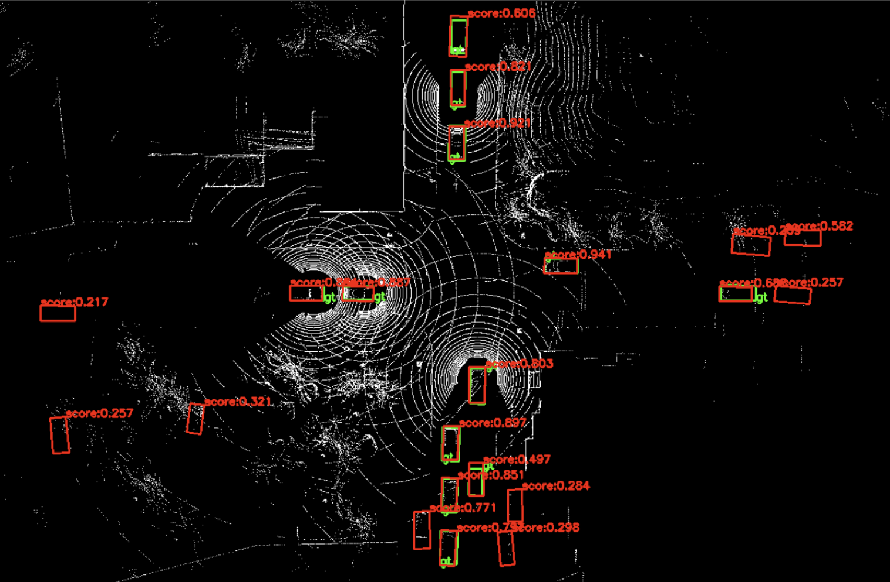

# Where2comm-V2X-Sim

# Implement Where2comm with V2X-Sim-2 dataset
---
**Author: Yihang Tao**

> *Where2comm published its code implementation with DAIR-V2X dataset, while has not yet released code working on V2X-Sim-2 dataset.*

## Introduction

**Where2comm** (*Hu et al., Neurips 2022*), a classic and milestone-like collaborative perception method, has only open its code implementation on DAIR-V2X dataset. However, there is only one ego vehicle in DAIR-V2X dataset, for those who wanna do experiments with multi-vehicle collaborative perception dataset (e.g., V2X-Sim-2 datset) and take Where2comm as baseline, it's still not convenient enough to realize. This article will introduce a method to smoothly train/test Where2comm model on V2X-Sim-2 dataset.

## Steps

#### 1. Merge HEAL and Where2comm (Skip step 1 if you clone this project)

Download HEAL and Where2comm.
```
git clone https://github.com/MediaBrain-SJTU/Where2comm.git
cd Where2comm
git clone https://github.com/yifanlu0227/HEAL.git
```
Substitute tools, utils, and visualization.
```
rm -rf opencood/tools
rm -rf opencood/utils
rm -rf opencood/visualization
cp -r HEAL/opencood/tools/ opencood/tools
cp -r HEAL/opencood/utils/ opencood/utils
cp -r HEAL/opencood/visualization/ opencood/visualization
```
Create a new directory and download file "[v2xsim2_where2comm_attn_multiscale_resnet.yaml]()" to it.
```
mkdir opencood/hypes_yaml/v2xsim2
```

Modify opencood/data_utils/datasets of Where2comm.
```
rm -rf opencood/data_utils/datasets/__init__.py
cp HEAL/opencood/data_utils/datasets/__init__.py opencood/data_utils/datasets/
cp HEAL/opencood/data_utils/datasets/basedataset/v2xsim_basedataset.py opencood/data_utils/datasets/
cp HEAL/opencood/data_utils/datasets/intermediate_fusion_dataset.py opencood/data_utils/datasets/
```

Modify install requirements of Where2comm.
```
rm -rf requirements.txt
cp HEAL/requirements.txt ./
```

#### 2. Environment setup

Project download.
```
git clone https://github.com/yihangtao/Where2comm-V2X-Sim.git
cd Where2comm-V2X-Sim/Where2comm
```

Install cuda 11.1 and customize installation path (see [Set CUDA Path](https://yihangtao.github.io/blog/2024/08/09/bevformer/#5-Set-CUDA-Path-Important) for more details).
```
conda create --name Where2comm python=3.7 cmake=3.22.1 cudatoolkit=11.2 cudatoolkit-dev=11.2
conda activate Where2comm
conda install cudnn -c conda-forge
conda install boost
# install pytorch
pip install torch==1.10.1+cu111 torchvision==0.11.2+cu111 torchaudio==0.10.1 -f https://download.pytorch.org/whl/torch_stable.html

# option: if there is error or speed issues in install cudatoolkit
# could instead specify the PATH, CUDA_HOME, and LD_LIBRARY_PATH, using current cuda
# write it to ~/.bashrc, for example use Vim
vim ~/.bashrc
export PATH=[your cuda path]/bin:$PATH
export CUDA_HOME=[your cuda path]/bin:$CUDA_HOME
export LD_LIBRARY_PATH=[your cuda path]/lib64:$LD_LIBRARY_PATH

# add head file search directories 
export C_INCLUDE_PATH=$C_INCLUDE_PATH:/miniconda3/envs/Where2comm/include
export CPLUS_INCLUDE_PATH=$CPLUS_INCLUDE_PATH:/miniconda3/envs/Where2comm/include
# add shared library searching directories
export LIBRARY_PATH=$LIBRARY_PATH:/miniconda3/envs/Where2comm/lib
# add runtime library searching directories
export LD_LIBRARY_PATH=$LD_LIBRARY_PATH:/miniconda3/envs/Where2comm/lib

# go out of Vim and activate it in current shell
source ~/.bashrc

conda activate Where2comm

# clone spconv:
git clone https://github.com/traveller59/spconv.git 
cd spconv
git checkout v1.2.1
git submodule update --init --recursive

# compile
python setup.py bdist_wheel

# install
cd ./dist
pip install spconv-1.2.1-cp37-cp37m-linux_x86_64.whl

# check if is successfully installed
python 
import spconv
```


#### 3. Install OpenCOOD
```
# install requirements
pip install -r requirements.txt
python setup.py develop

python opencood/utils/setup.py build_ext --inplace
python opencood/pcdet_utils/setup.py build_ext --inplace
# if there is cuda version issue; ssh db92 -p 58122 and customize the cuda home
CUDA_HOME=/usr/local/cuda-11.1/ python opencood/pcdet_utils/setup.py build_ext --inplace
```

#### 4. Prepare V2X-Sim-2 dataset

```
mkdir dataset

Where2comm/dataset
. 
├── v2xsim2-complete
│   ├── lidarseg
│   ├── maps
│   ├── sweeps
│   └── v1.0-mini
└── v2xsim2_info
    ├── v2xsim_infos_test.pkl
    ├── v2xsim_infos_train.pkl
    └── v2xsim_infos_val.pkl
```

#### 5. Basic Train / Test Command

Please refer to [Commands](https://github.com/yifanlu0227/HEAL?tab=readme-ov-file#basic-train--test-command) for more details.

Training process (Terminal)

Sampled visualization results (opencood/logs/)


Now everything should work! :-)

## Reference
[1] https://github.com/yifanlu0227/HEAL?tab=readme-ov-file
[2] https://github.com/MediaBrain-SJTU/Where2comm/tree/main
[3] https://ai4ce.github.io/V2X-Sim/
